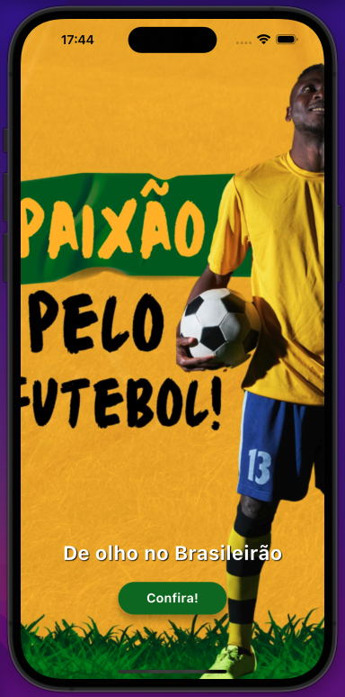
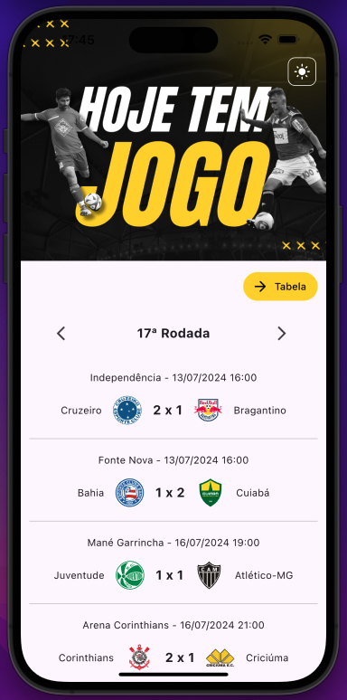
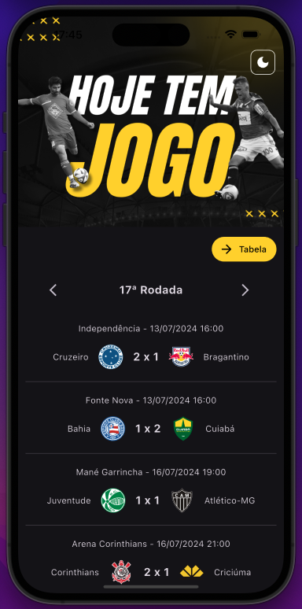
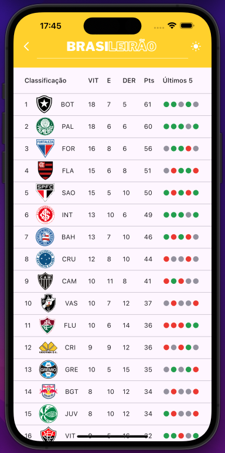
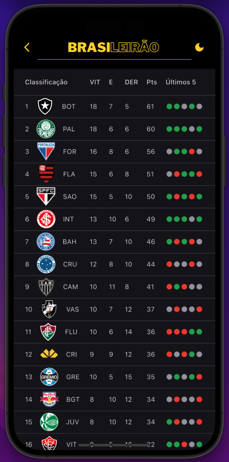

## 🚀 Visão Geral

O Futebol é indiscutivelmente uma paixão brasileira, e **O Brasileirão** te mostra os detalhes dessa paixão na palma de sua mão.

## 🛠️ Tecnologias

Este projeto foi construído utilizando tecnologias e frameworks modernos para garantir uma aplicação fluida, escalável e responsiva.

- **Flutter** para desenvolvimento mobile multiplataforma
- **GetX** para gerenciamento de estado
- **Shared Preferences** para persistência de dados
- **Dio** para manipulação de serviços de API
- **Mocktail** para testes unitários e de integração

## ✨ Funcionalidades

- Funcionalidade 1: Veja todos os jogos da rodada atual, anterior e próximas. Incluindo detalhes de local, data e hora, além de resultado final;
- Funcionalidade 2: Tabela completa da série A do campeonato, com detalhes do desenvolvimento de cada time nas últimas rodadas;
- Funcionalidade 3: Escolha de tema claro ou escuro para uma melhor experiência de usuário e conforto visual.

## 📸 Pré-visualizações

Aqui estão algumas pré-visualizações do app em ação:

### Intro

### Jogos da Rodada

  
  

### Tabela

  
  

## 🎥 Video Demo

*Confira uma rápida demonstração do app em ação!*

https://github.com/user-attachments/assets/ab1b7245-46bb-4224-a8b9-b1405d81e3f6
